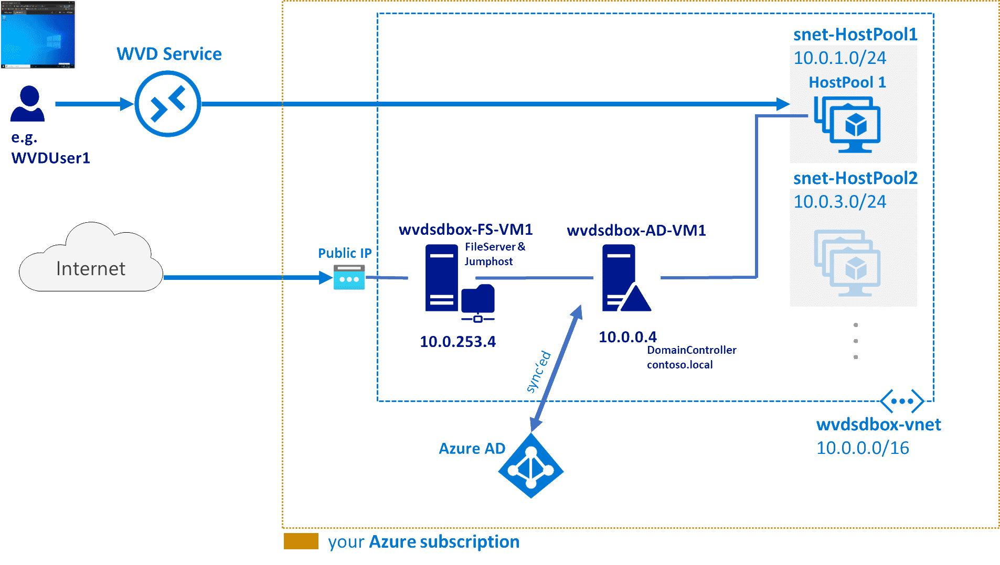

# My Windows Virtual Desktop (WVD) sandbox...
_is about building an Azure based demo environment for fast evaluation, testing, PoC, ..._  
_it should automate the things you are not interested in - to give you more time to focus on WVD._  

> **Warning**: Practices shown here are in **no way** best practices. **Focus of this lab is functionality & speed**.  
Beware that some assumptions have been made that will | might not be suitable for your real life environment.  
Nevertheless exercising this repo hopefully gives insights why things are different in real scenarios.  
So ride at your own risk and please use your brain ;-)  

## The WVD Sandbox Demo Environment
This is the architecture of the simple WVD sandbox:  
  

> **Note**: I don't follow strictly the naming conventions as proposed [here](https://docs.microsoft.com/en-us/azure/cloud-adoption-framework/ready/azure-best-practices/naming-and-tagging) - The reason? I like to see what's linked together when using the Azure Portal view & sorting. 
  
**The major components are:** 
* A Domain Controller: W2k19 Server with AD 'contoso.local' - + OU + Users
* A File Server: W2k19 Server with an additional disk used as file share.  

## The WVD Setup Journey  
The setup of WVD currently requires some things to be setup in order:  

## Ready?
[Go here for next steps](/SetupChallenges/README.md) (i.e. ordered setup)

## Cleanup? 
[Go here for cleanup routine](/CleanupChallenge/README.md)

## What the heck... 
...you may ask why do I:
1. [_Need a domain controller in this scenario?_](#The%20DC%20is%20used%20for...)
2. [_What is the file server used for?_](#The%20File%20Server%20is%20used%20as...)

### The DC is used for...
In WVD the desktop a user is connecting to - is a domain joined VM with a Windows OS on it. Hence the VM (aka 'Session Host') is domain joined on creation and therefore we need a DC.  
Under real life circumstances this DC would probably be installed in a VM in Azure that is syncing / replicating via a private Tunnel (S2S VPN | ExpressRoute) to an onpremise Domain Controller.  
Alternatively possible but fewer used is the Azure AD Domain Services feature (= 'AD as PaaS') in Azure.  
[back](#%20What%20the%20heck...) 

### The File Server is used as...
... a destination for profile data to be written to. Which profiles? Well, each user logging onto a Windows OS gets various profile folders (e.g. Documents, Pictures, Downloads,...). Content placed there should _'travel'_ with the user - as the user might catch a different VM (aka 'Session Host') at next logon.  
FSLogix - an aquisition Microsoft did recently provides tools that redirect profile data to a e.g. remote file share.  
[back](#%20What%20the%20heck...) 

I know there is already loads of content out there. Nevertheless I hope this saves you some time.  
Feedback welcome!  

Best,  
Bernhard
