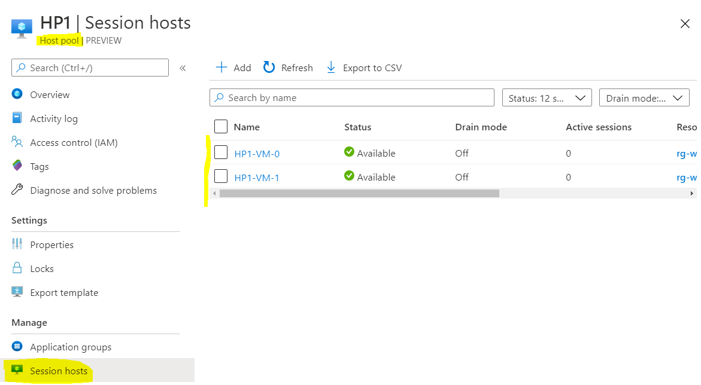
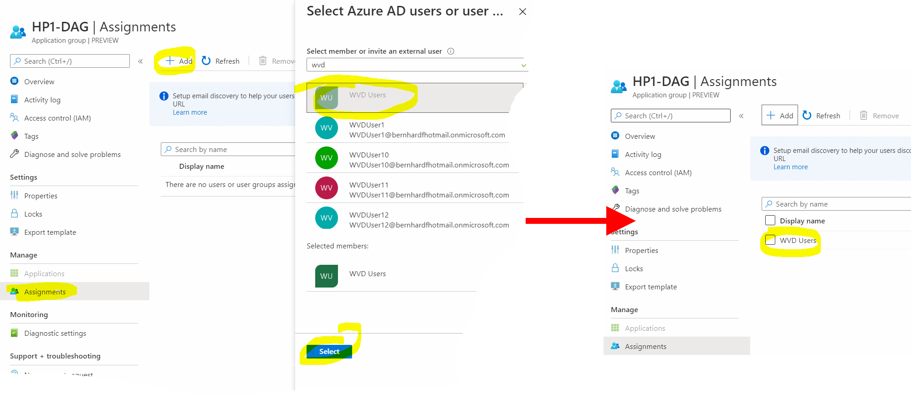
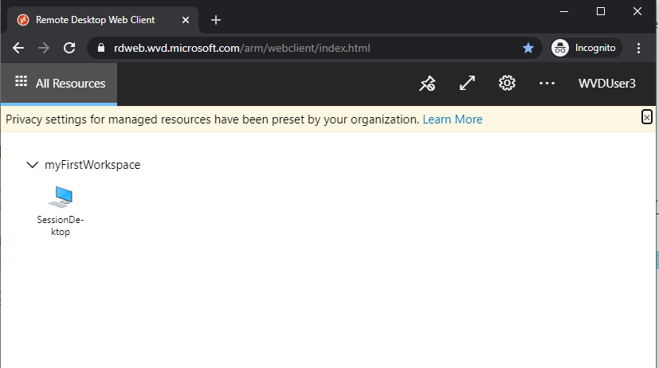

# Challenge 1: WVD Sandbox Requirements _or single subscription deployment vs. split subscription deployment_

[back](../../README.md)

| **WVD prerequisites** | **WVD Sandbox requirements** |
|--|--|
| <ul><li>A **valid Azure subscription** ;-) </li></ul>| <ul><li>A **valid Azure subscription**</li><li>**you have owner privileges**  (Azure Portal -> Subscription -> Access Control)</li></ul> |
| <ul><li>An **Active Directory accessible from the Azure subscription**.</li></ul> Why? Because the desktops will do a domain join. This is a current WVD requirement.  |  <ul><li>**WVD Sandbox will deploy an AD** (contoso.local) **for you**.  </li></ul>|
| <ul><li>An **Azure Active Directory** that is **sync'ed with** the above **Active directory**.</li></ul> Why? Because the users who access WVD need to logon with AAD credentials + AD credentials (not single sign on but 'same sign on'). | <ul><li>**You** need to be **global administrator of the Azure Active Directory** where your subscription is mapped to.</li><li>An **AAD** that is **not currently sync'ed with an AD** yet.</li></ul>Why? **You'll do the AD sync!** in one of the WVD sandbox challenges. |

## What you'll get - some screenshots:  
- **After challenge2** you will have some vms in your azure subscription (DC, Jumphost, Network):  

|   |  |
|--|--|
 
- **After challenge3** you will have user accounts in your AAD that you can assign permissions to access WVDesktops:  
  

- **In Challenge4** you create a WVD Host Pool:  
**Session Host**: Is a vm in your subscription a user is connected to. It serves as a desktop in your WVD environment. It can be a Windows Client (e.g. Windows 10 OS) or Windows Server. A session host has agents on it that connect it to the WVD backend.  
**Host Pool**: Is a group of Session Hosts that have identical configuration intented to serve the same group of users.  
  

- In **Challenge5** you Enable Remote Desktop Access For Users  
For this you assign a user group to an WVD **Application Group**


- In **Challenge 6**: You connect to your WVD workspace from a client.  
["...A workspace is a logical grouping of application groups in Windows Virtual Desktop. Each Windows Virtual Desktop application group must be associated with a workspace for users to see the remote apps and desktops published to them..."](https://docs.microsoft.com/en-us/azure/virtual-desktop/environment-setup#workspaces)  
  

## Single subscription deployment versus split subscription deployment.  
When you allow users to access desktops (or applications) via the portal you make an assignment:  
  
**Note**: The **users you can select from are in the same 'realm' as the WVD configuration**.  
**But what if you want different users, groups from a different AD to access session hosts?**    
**Why?** **Probably** because **you want to test** and **don't mess with your existing AAD** (were you may lack permissions anyway) - or you want to split the consumption / billing amongst multiple subscriptions.  
**So the question is - can I have users from a different AD/AAD be accessing my host pool?**    


**Yes**, you'll need to **setup your WVD config with AAD in subscription 2** and **setup manually the vms in subscription 1** and **configure the agents in the vms to make them register as 'session hosts' within the WVD Hostpool in subscription 2**.  
|pros | cons |
|--|--| 
| <ul><li>split bill possible</li><li>can use 'my' users</li><li>circumvent AAD permission shortage</li></ul>| <ul><li>you need 2 active subscriptions</li><li>no 'single pane of glass' management</li><li>cannot use portal to setup session hosts (manual)</li></ul> |
### Still not sure?
Take a look at the current sync status of your AAD:  
```
[Azure Portal] -> Azure Active Directory
``` 
| <H3>Looks like this?</H3> | <H3>or like that?</H3> |
|--|--|
|   |   |
| **Good to go!** | **This AAD is sync'ing already**. Maybe you want to do a split subscription deployment.|
  
The **WVD Sandbox assumes you will do a single subscription deployment**. However if you run / perform the steps accordingly in the right subscriptions you can achieve a split subscription deployment with the content here. However I have not documented it explicitly.  
 

[next](../Challenge2/README.md) 
